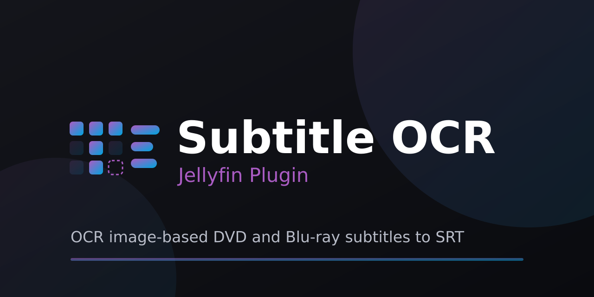

<p align="center">
  
</p>

# jellyfin-plugin-subtitleocr

Converts embedded image-based subtitles (dvdsub/VobSub and PGS/Blu-ray) to SRT (`.srt`) or
ASS (`.ass`) files using nOCR pattern matching: no Tesseract, no native dependencies, pure
managed code. Database format is interchange-compatible with [Subtitle Edit](https://github.com/SubtitleEdit/subtitleedit)'s
`.nocr` files, so databases trained or corrected in SE's GUI drop straight in.

<p align="center">


</p>

## Installation

### From a Jellyfin repository (recommended)

1. In the Jellyfin dashboard, go to **Plugins > Repositories > +**.
2. Add a repository with this manifest URL:
   ```
   https://raw.githubusercontent.com/IDisposable/jellyfin-plugin-subtitleocr/main/manifest.json
   ```
3. Open the **Catalog** tab and find **Subtitle OCR** under the *Subtitles* category.
4. Click **Install**.
5. Restart your Jellyfin server.

New releases show up in the catalog automatically.

### Beta channel

For pre-release builds, use this manifest URL instead:
```
https://raw.githubusercontent.com/IDisposable/jellyfin-plugin-subtitleocr/main/manifest-beta.json
```

Both channels publish the same builds; the stable channel carries only stable releases,
the beta channel carries all releases. Add one repository or the other, not both.

### Manual

Download the `.zip` from the latest [GitHub release](https://github.com/IDisposable/jellyfin-plugin-subtitleocr/releases),
extract it into a folder under your server's `config/plugins/` directory (e.g.
`config/plugins/SubtitleOcr/`), and restart Jellyfin.

Your server version must match the plugin's target ABI (currently `10.11.0.0`, `net9.0`).

## Status: Beta

The core library is implemented and verified. The Jellyfin host layer has been run against a
live 10.11 server over a 14,000 item library.

## Features

- **Formats in:** VobSub (DVD) and PGS (Blu-ray), from any container ffprobe can read.
- **Formats out:** SRT, ASS, or Auto. Auto writes ASS only for a track that needs it (a cue
  positioned away from the bottom of the screen) and SRT for everything else.
- **Naming:** `{name}.{lang}.OCR.srt`. The `OCR` tag marks the file as plugin-created, and
  because output only ever goes to that tagged path, source and hand-made subtitles are never
  overwritten or deleted. The track title, stream index, and forced, hearing-impaired, and
  commentary flags are folded into the name when present, so a commentary track is
  identifiable rather than another anonymous `{name}.{lang}.srt`.
- **Text correction:** conservative l/I-class fixes, contraction apostrophes, mid-word capital
  X/V/I, optional ellipsis folding, optional Hunspell spell-check, and optional Subtitle Edit
  OCR fix replace lists.
- **Language:** the stream language selects the OCR database; an undetermined track has its
  language detected from the OCR text.
- **Identity from the text:** a disc remux commonly tags its subtitle tracks with nothing at all,
  no language, title, or flags. What the container will not say, the OCR text often will: the
  language, and whether the track is hearing-impaired (SDH), which is recognizable because SDH
  describes sound the viewer cannot hear ("[engine roaring]") and ordinary dialogue does not.
- **Scanning:** ffprobe is the sole detector (Jellyfin does not store image-based streams in
  its metadata), with a per-file cache so unchanged files are not re-probed every run.

## Architecture

```
Jellyfin.Plugin.SubtitleOcr        host layer (Jellyfin.Controller 10.11)
├── Plugin.cs                      registration + config page; nocr/dictionary data folders
├── Pipeline/SubtitleOcrPipeline   per-file orchestration; caches DBs across runs
├── MetadataWords.cs               protected words from the item's Jellyfin metadata
├── ExtractionLog.cs               record of every file written (drives the config modal)
├── Api/SubtitleOcrController      GET/DELETE the extraction log
└── ScheduledTasks/
    ├── OcrSubtitlesTask           finds VobSub/PGS items; refresh + progress reporting
    └── ReprocessSubtitlesTask     re-OCRs logged files with the current settings

SubtitleOcr.Core                   zero Jellyfin dependencies, fully testable
├── Extraction/FfprobeSubtitleReader  ffprobe JSON → packets + stream list (VobSub/PGS)
├── VobSub/                        SPU control sequences + RLE → RGBA; per-packet timing
├── Pgs/                           PGS segment/RLE decoder; show/clear timing; cue position
├── Subtitles/SubtitleImage        format-agnostic timed bitmap the OCR consumes
├── Imaging/                       binarization, projection-profile segmentation
├── NOcr/                          .nocr DB read/write, match cascade, engine
├── Ocr/                           language codes, l/I-class fixes, spell-check,
│                                  SE OCR fix lists, language detection
└── Output/                        timing normalization + SRT and ASS serialization
```

Data flow per file:

1. One `ffprobe -show_streams -show_format -show_chapters -show_data` pass lists image-based
   subtitle streams (VobSub and PGS) with their language, title, and disposition flags, and
   collects the container's textual metadata as protected words. VobSub palette is parsed from
   the idx-style extradata (ffmpeg default as fallback); PGS carries its palette in-band.
2. `ffprobe -show_packets -show_data` per stream yields assembled display units regardless of
   container (MKV, VOB/PS, M2TS): no PES demux or mkvextract needed.
3. VobSub SPUs decode per packet (end time from the StopDisplay delay, then packet
   duration, then the next packet). PGS display sets decode across packets: a "show"
   set is bounded by the next "show" or "clear". Both yield a timed `SubtitleImage`;
   PGS also carries where on screen the cue sat.
4. Binarize, segment into glyphs, match against the per-language nOCR database,
   assemble text with word spacing and `<i>` runs, then post-process (character fixes,
   OCR fix list, spell-check).
5. Cues are buffered per track, so the language can be detected from the finished text and
   the container chosen from whether any cue is positioned. Timings are normalized and the
   file is written (`{name}.{lang}.OCR.srt` or `.ass`); a track that dropped too many events
   is discarded instead. The task then queues a library refresh so Jellyfin attaches the
   result immediately.

## Verified (SubtitleOcr.Core.Tests, xunit)

- Bundled `Latin.nocr` (from Subtitle Edit, MIT): loads all 690 glyphs; parse
  consumes the file byte-exactly
- Save/load round-trip is lossless
- Matcher self-recognition: 96% at zero error budget (rasterizing a glyph's own
  trained foreground lines and matching it back)
- SPU decoder: hand-encoded subpicture decodes to pixel-exact output, including
  the end-of-line nibble realignment path
- PGS decoder: hand-encoded display set decodes to pixel-exact output; show/clear
  display sets pair into correctly timed events
- VobSub and PGS track timing (StopDisplay / next-packet / show-clear bounding)
- Hex dump parser matches ffprobe's `print_data_xxd` exactly (verified against
  fftools source), including the ambiguous single-space-pad full-line case
- Language-code normalization (639-1/2B/2T) and Latin-script gating
- SRT timing normalization and serialization; ASS header, timecodes, and alignment buckets
- Post-processor: l/I-class fixes, contraction apostrophes, ellipsis folding, and the
  non-Latin gating that keeps those heuristics off other scripts
- Spell-check leaves proper nouns and protected words alone and rejects suggestions that
  split a word
- OCR fix replace list applies whole-word and regex rules only
- Language detection picks the right language from sample text

Run: `dotnet test`

## Building the plugin

```bash
dotnet publish Jellyfin.Plugin.SubtitleOcr -c Release
# or via jprm using build.yaml
```

Targets Jellyfin 10.11 / net9.0 by default. To build against another ABI without
editing the csproj, pair the two overrides, e.g.
`dotnet build -p:JellyfinVersion=10.10.7 -p:TargetFramework=net9.0` (restore separately
first when overriding `TargetFramework`).

## Languages

The stream language selects the OCR database. Latin-script languages (English, French,
German, Spanish, ...) all use the bundled `Latin.nocr`; the output is tagged with the
stream's language (`{name}.{lang}.OCR.srt`, multiple same-language tracks keep the source
stream index). Non-Latin scripts need their own database (Cyrillic, Greek, ...); only the
Latin database is bundled, so obtain or train the others in Subtitle Edit's nOCR window.

A track tagged `und` (or with no language at all) has its language detected from the OCR text
and is named with what was detected, so untagged tracks do not pile up as `{name}.und.OCR.srt`.
Detection covers 17 Latin-script languages and only commits when one clearly wins; otherwise
the track stays `und`.

To install one, drop a file named `{language}.nocr` (e.g. `rus.nocr`, `ell.nocr`) into the
plugin's `nocr` data folder and it is used automatically; or add a per-language entry on the
config page (its path may be absolute or a bare file name in that folder). Resolution order
per language: config entry, then drop-in `{language}.nocr`, then the global database path,
then bundled Latin. English-only OCR fixups are skipped for non-Latin scripts.

Enable "Skip image tracks whose language already has a text subtitle" on the config page to
OCR only the languages you are missing: an image track is skipped when the item already has a
text-based subtitle (embedded stream or external sidecar) in the same language. Untagged
image tracks are always converted, since their language cannot be matched with confidence.

## Text correction

Three passes run over the OCR text, in order, each optional and each language-aware:

1. **Character fixes** for the classic confusions: lone `l` to `I`, sentence-initial `l`,
   pipes, mid-word capital `X`/`V`/`I` (`GaIactica` to `Galactica`), and a placeholder sitting
   in a contraction slot (`it□s` to `it's`). Optionally folds dot runs (`...`, `. . .`) into a
   single ellipsis. These are Latin-script heuristics and are skipped for other scripts. Bogus
   italic runs are also dropped here: the database holds italic and upright variants of each
   glyph, and matching the wrong one for a single character produced markup like `<i>.</i>` that
   also split the word for every later stage.
2. **Subtitle Edit OCR fix replace lists**, when a `{lang}_OCRFixReplaceList.xml` is present.
   Only the whole-word and regular expression rules are applied; SE's partial-word rules
   assume a different matching stage and corrupt real words here.
3. **Hunspell spell-check**, when a `{lang}.dic` and `{lang}.aff` are present. Only close
   single-word corrections are accepted. Title-case proper nouns are left alone, as are words
   drawn from the item's Jellyfin metadata (title, overview, series, cast and character names)
   and the container's own text tags, so show and character names are never "corrected" into
   something else. An unread glyph is a wildcard rather than a wrong letter: `batt□e` is one
   edit from `battle`, and `Ga□actica` resolves outright against a protected word, so a name the
   dictionary does not know still survives OCR damage. A word that is mostly placeholders is
   left as it is; there is not enough of it left to guess from.

Both dictionaries and fix lists are drop-in: put them in the plugin's `dictionaries` data
folder. Enable the download options to fetch them automatically instead (sources are
configurable URL templates), and set the refresh interval to re-download them once stale.
Nothing is bundled.

## Known gaps (roughly in priority order)

1. **Segmentation is projection-profile only.** Italic glyphs that overlap
   vertically merge into one segment and fail to match. SE's splitter handles
   this with per-pixel flood fill and italic-shear heuristics, a port candidate.
2. **Expanded (multi-segment) glyph matching not wired into the engine.**
   The DB loads the 19 expanded entries but `NOcrEngine` only does single-glyph
   matching. Ligature-heavy fonts will show as unknowns.
3. **Binarization is luma-threshold only.** Works for the standard light-text/
   dark-outline case (with `InvertLuma` for the reverse); discs with unusual
   CLUT usage may need per-color-index selection instead.
4. **No unknown-glyph export.** Dumping unmatched glyph bitmaps (BMP) to a
   training folder would close the loop with SE's nOCR training window.
5. **PGS timing assumes one display set per packet.** Holds for MKV and typical
   M2TS demuxes; a display set split across packets would need cross-packet ODS
   accumulation. Cropped-object composition is handled but rarely exercised.
6. **VobSub carries no cue position.** The SPU display area is relative to a frame height
   the packet does not state, so every VobSub cue is treated as bottom-placed and `Auto`
   always picks SRT for a VobSub track. PGS states its screen height, so positions are real.
7. **Color is ignored when choosing a format.** `Auto` triggers on position only; a track
   that uses color alone to distinguish speakers still becomes SRT.

## License

MIT. See NOTICE.md for third-party attribution: Subtitle Edit (nOCR format/matcher port,
the bundled Latin database, and the OCR fix list format) and WeCantSpell.Hunspell (MPL 1.1).
